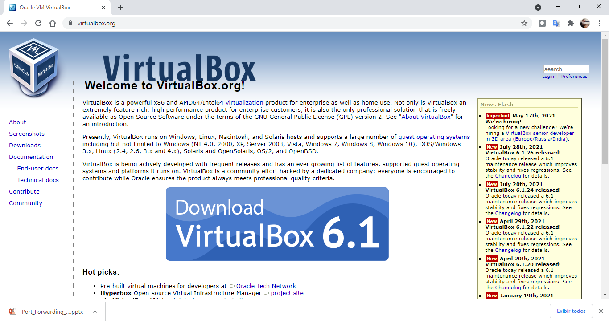
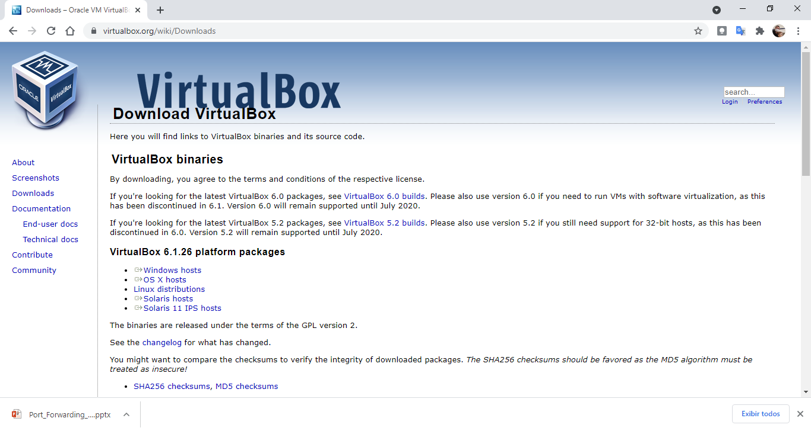
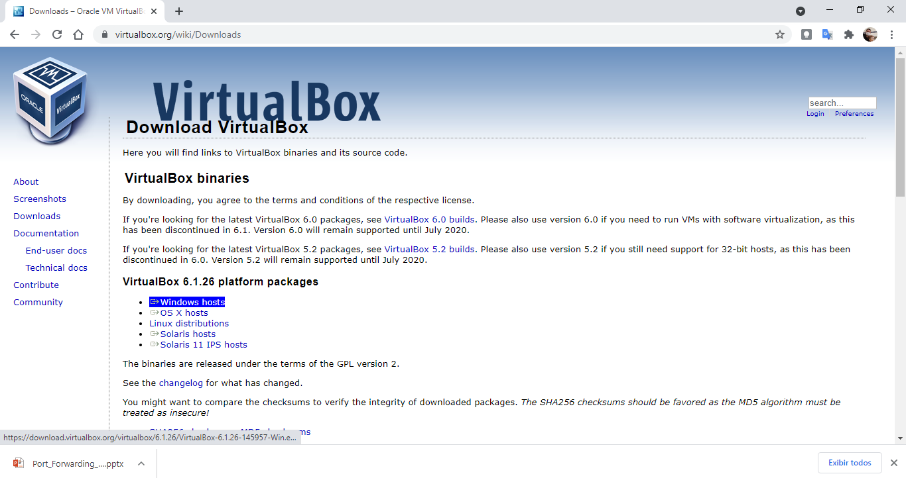
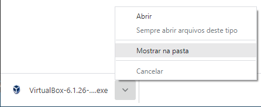
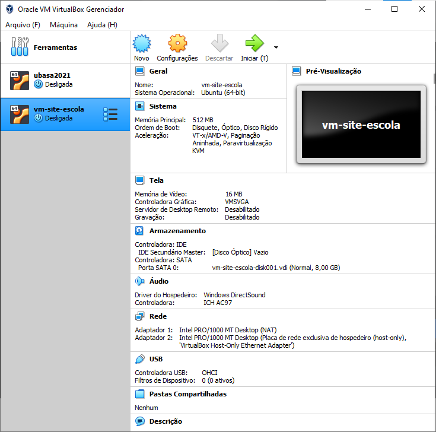

# Instalação do VirtualBox no Windows 10

O Oracle VirtualBox (Caixa Virtual em inglês) é programa de virtualização de computadores que utilizaremos para executar o servidor web que hospedará a versão de teste de nosso site.

Neste tutorial, vamos fazer as seguintes operações com o VirtualBox:

1. Baixá-lo
2. Instalá-lo como **Administrador**

Vamos aos passos:

1. Acesse: [virtualbox.org](https://www.virtualbox.org/);

    

2. Clique no link [Downloads](https://www.virtualbox.org/wiki/Downloads);

    

3. Clique no link **Windows hosts** e salve o arquivo.

    

4. Peça para mostrar o arquivo na pasta.

    

5. Abra a pasta *Downloads* de seu computador, clique o botão direito do mouse sobre o arquivos de instalação do VirtualBox e selecione a opção** Executar como administrador**.

    

6. Execute o assistente de instalação do VirtualBox e marque as opções padrões (E responda **Sim** quando perguntado).

    

7. Felicitações. Agora você tem um ambiente para execução de máquinas virtuais (VM -- Virtual Machines).

    

